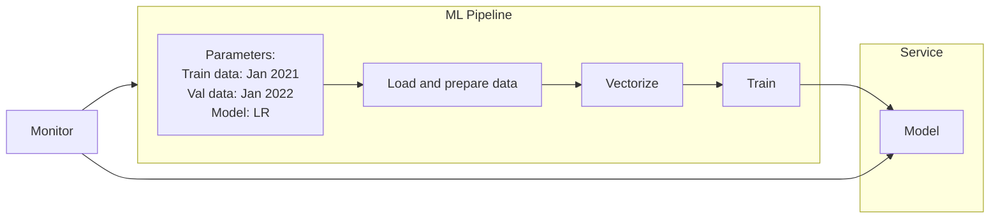

# Intro

## Setup

Set up Anaconda to run Jupyter Notebooks by running the following script. It supports both macOS and Linux.

```bash
./setup-anaconda.sh
```

In a new terminal session, start the Jupyter Notebook server.

```bash
./start-jupyter-notebook.sh
```

## MLOps Pipeline

This is what an ML (Machine Learning) pipeline could look like.

To make it easier to evaluate different configurations, the training data, validation data, and model can be adjustable parameters.

The main machine-learning-specific tasks of the pipeline are:
1. Load and prepare data
2. Vectorize
3. Train

The pipeline outputs a model that can be deployed to a service where it can be used to make predictions.

A monitoring component reviews the model's performance and alerts or re-runs the pipeline when prediction quality falls below a threshold.

