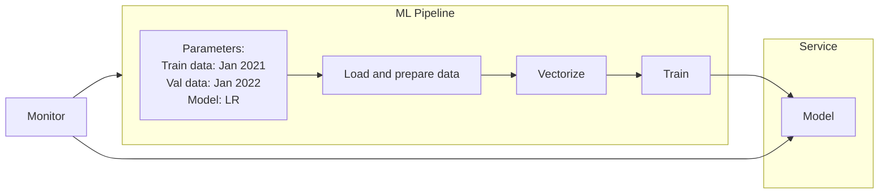

# Intro

## Setup

Set up Anaconda to run Jupyter Notebooks by running the following script. It supports both macOS and Linux.

```bash
./setup-anaconda.sh
```

In a new terminal session, start the Jupyter Notebook server.

```bash
./start-jupyter-notebook.sh
```

## Notebooks

These notebooks explored machine learning concepts using the New York City Taxi and Limousine Commission Trip Record Data.

### [Duration Prediction](/01-intro/duration-prediction.ipynb)

The duration prediction notebook served as an introduction, covering the following actions:
- Read Parquet files.
- Visualize the data.
- Filter out rows.
- Add a new column.
- Train linear models on the data.
- Evaluate prediction errors.
- Define reusable functions for training and validation.

It used the Green Taxi Trip Records from January and February of 2021

### [Homework](/01-intro/homework.ipynb)

For the homework, the duration prediction was used as a refence to answer the questions
in the [homework assignment](https://github.com/DataTalksClub/mlops-zoomcamp/blob/main/cohorts/2025/01-intro/homework.md).

It used the Yellow Taxi Trip Records from January and Febraury of 2023.

## MLOps Pipeline

This is what an ML (Machine Learning) pipeline could look like.

To make it easier to evaluate different configurations, the training data, validation data, and model can be adjustable parameters.

The main machine-learning-specific tasks of the pipeline are:
1. Load and prepare data
2. Vectorize
3. Train

The pipeline outputs a model that can be deployed to a service where it can be used to make predictions.

A monitoring component reviews the model's performance and alerts or re-runs the pipeline when prediction quality falls below a threshold.



## MLOps Maturity Model

The maturity model defines the common practices that tend to happen at different MLOps adoption stages. It can help assess the current situation and guide towards more automated and better monitored processes.

A more detailed overview can be found at https://learn.microsoft.com/en-us/azure/architecture/ai-ml/guide/mlops-maturity-model.

0. No MLOps
    - No automation
    - All code in Jupyter
    - Proof of concept
1. DevOps, No MLOps
    - Releases are automated
    - Unit and integration tests
    - CI/CD
    - Ops metrics
    - No experiment tracking
    - No reproducibility
    - Data scientist separated from engineers
2. Automated Training
    - Training pipeline
    - Experiment tracking
    - Model registry
    - Low friction deployment
    - Data scientist work with engineers
3. Automated Deployment
    - Easy to deploy model
    - A/B tests
    - Model monitoring
4. Full MLOps Automation
    - Automated training/retraining
    - Automated deployment
    - Fully monitored
