# Experiment Tracking

## Concepts

- ML Experiment: The process of building a model.
- Experiment Run: The execution of an experiment with specific parameters.
- Run Artifact: The produced by the experiment run.
- Experiment Metadata: Additional information related to the experiment.

Experiment tracking means keeping a record of the information related to an ML experiment.
This could be:
- Source code
- Environment
- Data
- Model
- Hyperparameters
- Metrics

## MLflow

[MLflow](https://mlflow.org/) is a platform for managing LLMs, AI agents, and machine learning models.

It covers two main areas:
- LLMs and Agents: observability, evaluation, prompt management, model access, and cost control.
- Machine Learning: experiment tracking, model evaluation, model registry, and model deployment.

As the Zoomcamp focuses on traditional machine learning workflows, the capabilities of MLflow to manage LLMs and agents will not be explored.

## MLflow Setup

```bash
uvx mlflow server
```


The home screen of MLflow shows recent experiments. In the top left corner is a toggle to switch between GenAI (LLMs and agents) and Model training (machine learning). Here we use Model training, which includes Experiments and Model registry as the two top-level options.

To track an experiment run, use the following code snippet.

```python
import mlflow

mlflow.set_tracking_uri("http://localhost:5000")
mlflow.set_experiment(experiment_name="nyc-taxi")
mlflow.autolog()
```

See the [diabetes-experiment](/02-experiment-tracking/diabetes-experiment.ipynb) notebook for a simple example of how MLflow can be integrated.

In MLflow, this shows up as a new run with a random name (blushing-gnu-288 in this case).


A model related to the run is also registered.


Alternatively to the autologging, specific sections can be marked to be recorded as a run.
Metadata such as tags, parameters, and metrics can also be logged explicitly.

```python
with mlflow.start_run():
    mlflow.set_tag('developer', 'daniel')
    mlflow.log_param('alpha', 0.01)

    # training steps

    mlflow.log_metric('rmse', 5)
```

See the [duration-prediction](/02-experiment-tracking/duration-prediction.ipynb) notebook for the actual instructions.

The logged information then show up in the experiment run UI, in this example, under metrics, parameters, and tags.


## Conda Setup

Conda is an environemnt manager for Python that helps with keeping package versions isolated from other projects to avoid conflicts. 

### Initialize Conda Config

```bash
conda init --all # Initialize all currently available shells.
conda create --name exp-tracking-env
```

### Activate Conda Environemnt

```bash
conda activate exp-tracking-env
```

### Install Dependencies

```bash
pip install -r requirements.txt
```

### Deactivate Conda Environment

```bash
conda deactivate
```

## Experiment Run

For the experiment run, the [duration-prediction](/02-experiment-tracking/duration-prediction.ipynb) notebook was used, which was based on the notebook of the same name from the [intro](/01-intro/README.md).

Instead of manually trying different training parameters values to find the best model, the [hyperopt](https://hyperopt.github.io/hyperopt/) library was used to perform hyper-parameter optimisation.

The model training was done using the [xgboost](https://xgboost.readthedocs.io/en/stable/) library.


After evaluating the first run, the comparison graph showed a lot of lines passing through the lower regions of the parameters. To see if the results could be improved, another experiment with lower parameter values was performed.


The second run didn't show any meaningful improvement or insights into which tuning parameters affect the training the most.

So the best run was picked and rerun to capture more details and store the model using autolog.
Only some frameworks support autologging. See https://mlflow.org/docs/latest/ml/tracking/autolog/#supported-libraries.


The detailed run took longer (8.2 seconds vs. 1.4 seconds) likely due to capturing all the additional information.


The model also includes information about the dependencies to be able to reproduce the results later.


## Machine Learning Lifecycle

```mermaid
%%{init: {'flowchart': {'defaultRenderer': 'elk'}}}%%
flowchart LR
    data_sourcing(Data Sourcing)
    data_labeling(Data Labeling)
    data_versioning(Data Versioning)
    model_architecture(Model Architecture)
    model_training(Model Training)
    model_evaluation(Model Evaluation)
    model_versioning(Model Versioning)
    model_deployment(Model Deployment)
    scaling_hardware(Scaling Hardware)
    prediction_monitoring(Prediction Monitoring)

    subgraph data_management [Data Management]
        data_sourcing
        data_labeling
        data_versioning
    end

    subgraph mlops [MLOps]
        data_management
        model_management
        prediction_monitoring
    end

    subgraph model_management [Model Management]
        experiment_tracking
        model_versioning
        model_deployment
        scaling_hardware
    end

    subgraph experiment_tracking [Experiment Tracking]
        model_architecture
        model_training
        model_evaluation
    end

    data_sourcing --> data_labeling
    data_labeling --> data_versioning
    data_versioning --> experiment_tracking
    model_architecture --> model_training
    model_training --> model_evaluation
    model_evaluation --> model_architecture
    experiment_tracking --> model_versioning
    model_versioning --> model_deployment
    model_deployment --> prediction_monitoring
    model_deployment --> scaling_hardware
    model_deployment --> data_labeling
```



This diagram is based on the diagram shown in [MLOps Zoomcamp 2.4 - Model management - Youtube](https://www.youtube.com/watch?v=OVUPIX88q88).
