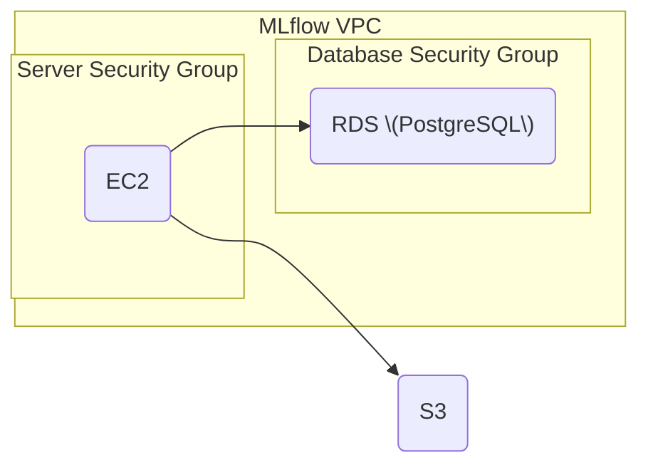

# MLfLow on AWS



## Lessons Learned
- If applying a change fails because an existing resource already exists, the resource can be imported with `tofu import <resource> <id>`
- Leaving the name on aws_db_subnet_group unset recreates the resource because the name is randomly generated

## Prerequisites

- Tofu
- AWS Account
- AWS CLI

## Setup

### Set Up AWS CLI Authentication

1. In the AWS Console, click in the top right corner and click on Security credentials.
2. Scroll down to the "Access keys" section and click "Create access key".
3. Select the "Command Line Interface (CLI)" use case.
4. Give it a name and click "Create access key".
5. In the terminal, run `aws configure --profile mlops`
6. Copy the Access key and Secret access key from the AWS Console into the terminal.

### Initialize Terraform

Create a `prod.tfvars` file in the [environemnts](/02-experiment-tracking/running-mlflow-examples/scenario-3-iac/environment) folder.
Use the [prod.tfvars.example](/02-experiment-tracking/running-mlflow-examples/scenario-3-iac/environment/prod.tfvars.example) file as a starting point.

To get the your IP address, run `curl checkip.amazonaws.com`.

To get the latest version of Postgres, run the following.

```bash
aws rds describe-db-engine-versions --engine postgres --default-only
```

Then initialize terraform with `tofu init -var-file environment/prod.tfvars`

### Create a Key Pair

1. Go to EC2 -> Key Pairs.
2. Click "Create key pair".
3. Give it a name. Also set this name in the tfvars file in the environment folder.
4. Click "Create key pair" again.
5. Download the key pair file.

Change file permission

### Review Changes

```bash
tofu plan -var-file environment/prod.tfvars
```

### Apply Changes

```bash
tofu apply -var-file environment/prod.tfvars
```

### Access Server

Show the output variables

```bash
tofu refresh -var-file environment/prod.tfvars
tofu output -var-file environment/prod.tfvars
```

Then use SSH to expose the MLFlow service locally.

```bash
ssh -i key-pair.pem -L 5000:localhost:5000 ec2-user@<server_ip>
```

### Cleanup

```bash
tofu destroy -var-file environment/prod.tfvars
```
