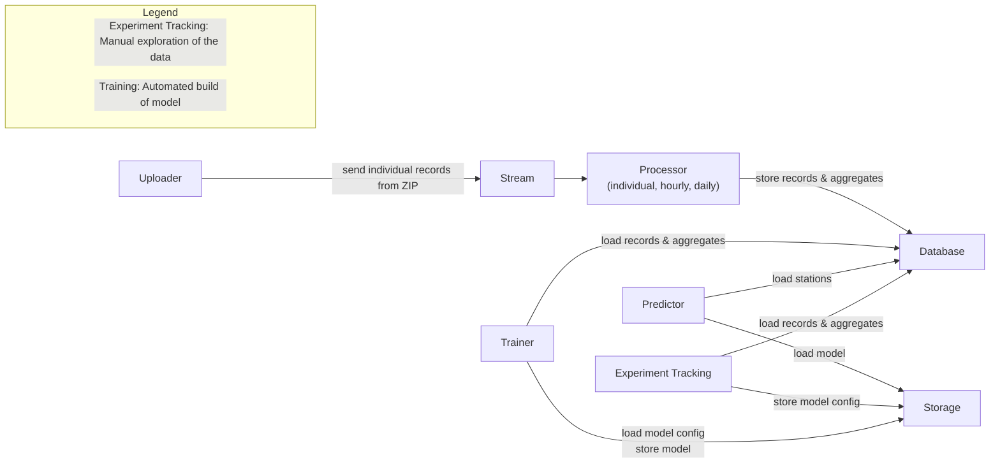

# MLOps Project

airflow for periodic evaluation of production data
evidently for quality monitoring graphs
fastapi for prediction service
docker for packaged model
jupyter notebook for manual experiments
mlflow for experiment tracking
aws for infrastructure
terraform for infrastructure definition

during training, data is evaluated as a batch and packaged as a docker container
individual entries get stored together with the prediction and later evaluated as a batch

information to capture
- inputs
- prediction
- model parameters

## Dataset

Citi Bike Trip Histories
https://citibikenyc.com/system-data

Download folder
https://s3.amazonaws.com/tripdata/index.html

Additional processing and data needed:
augment the data with day of week and holidays

components
- ingestor cli: reads a csv file and sends individual lines to a stream
- kafka/redpanda: stream engine
- processor: reads from stream, stores individual records and aggregated records by hour/day and station
- redis/valkey: cache data like existing stations
- postgres: stores records: individual, hourly, daily, stations
- mlflow: experiment tracking
- s3: experiment storage
- predictor: gives prediction for number of bikes at a station at a give hour/day

## Architecture

